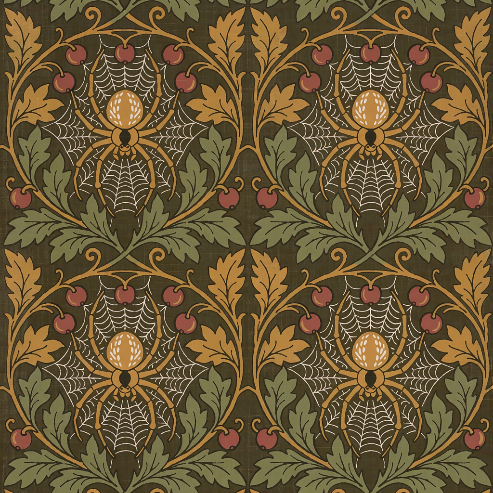
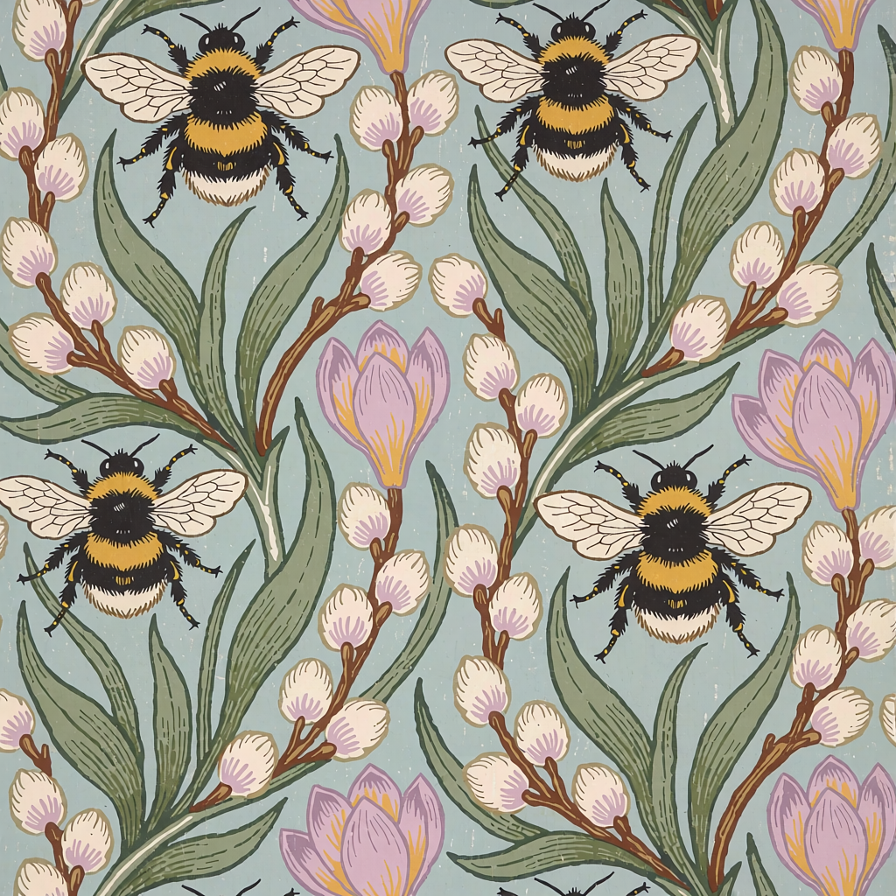
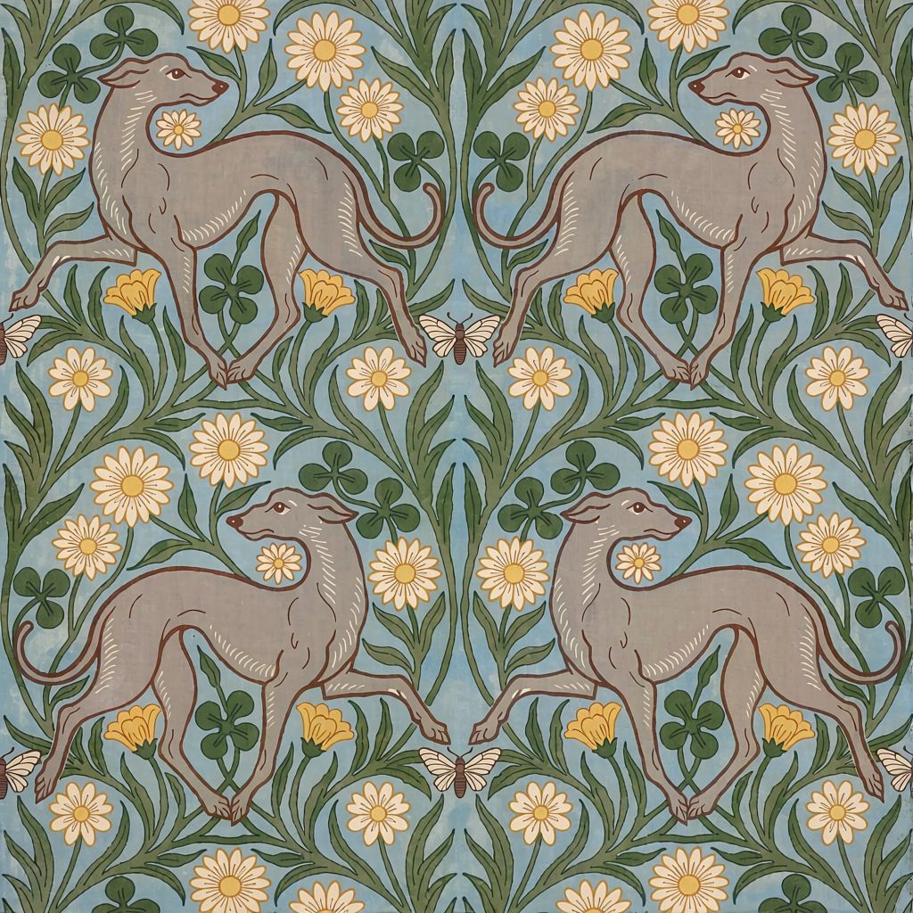
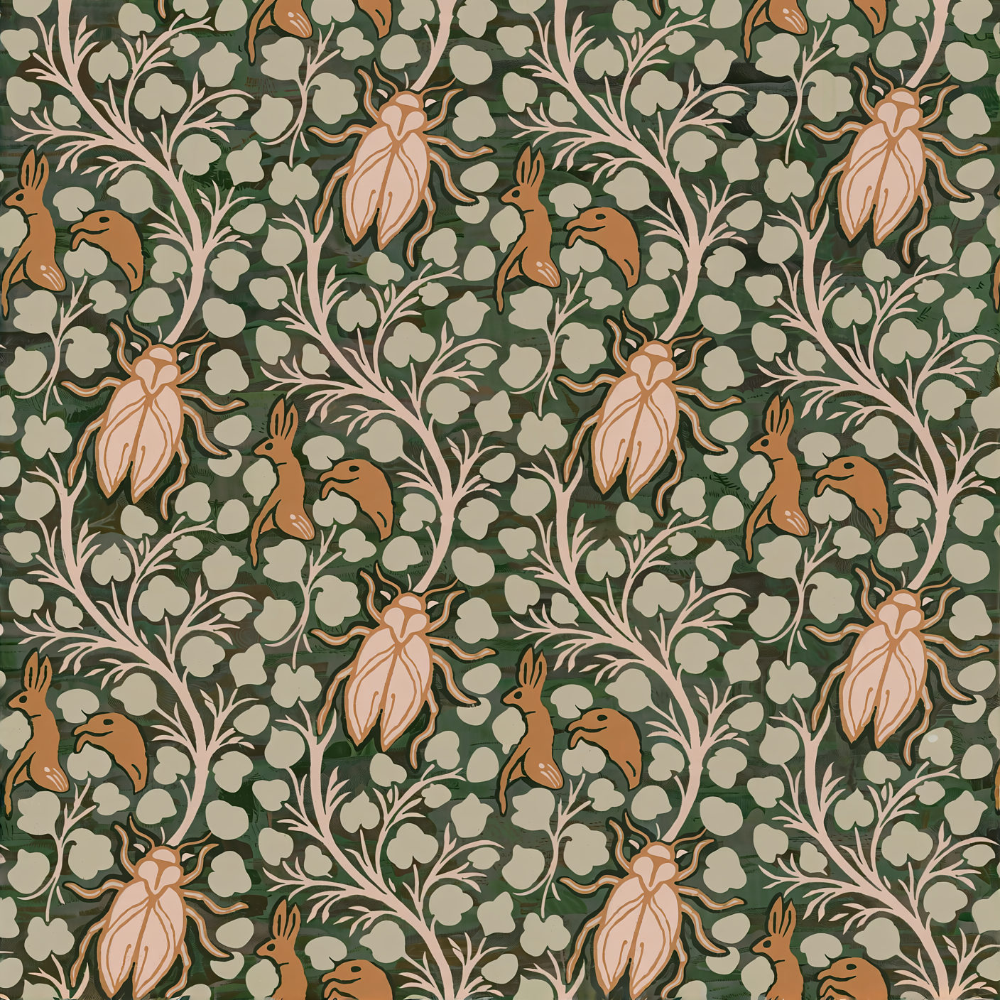

# Generated image gallery

27 original-resolution PNGs from nine William Morris workflow families. Each PNG retains sanitised workflow and API-prompt metadata, and has a separate captured workflow JSON. The encoded image pixels are unchanged.

Use **Captured workflow** for the graph saved with that render. **Library workflow** is the current editable collection version; prompts and settings may have changed since the example was produced. Exact reproduction also depends on models, software, seed and tag shuffle state.

[Setup](docs/SETUP.md) · [All workflows](CATALOG.md) · [Morris tags](docs/PIXAROMA-TAGS.md)

## Autumn

| Example 1 | Example 2 | Example 3 |
|---|---|---|
|  [Captured workflow](examples/william-morris/autumn/001.workflow.json) · [API prompt](examples/william-morris/autumn/001.api.json) |  [Captured workflow](examples/william-morris/autumn/002.workflow.json) · [API prompt](examples/william-morris/autumn/002.api.json) |  [Captured workflow](examples/william-morris/autumn/003.workflow.json) · [API prompt](examples/william-morris/autumn/003.api.json) |

[Library workflow](workflows/Gold-Standard/William-Morris-Themes/William-Morris-Autumn.json)

## Christmas

| Example 1 | Example 2 | Example 3 |
|---|---|---|
|  [Captured workflow](examples/william-morris/christmas/001.workflow.json) · [API prompt](examples/william-morris/christmas/001.api.json) |  [Captured workflow](examples/william-morris/christmas/002.workflow.json) · [API prompt](examples/william-morris/christmas/002.api.json) |  [Captured workflow](examples/william-morris/christmas/003.workflow.json) · [API prompt](examples/william-morris/christmas/003.api.json) |

[Library workflow](workflows/Gold-Standard/William-Morris-Themes/William-Morris-Christmas.json)

## Easter

| Example 1 | Example 2 | Example 3 |
|---|---|---|
|  [Captured workflow](examples/william-morris/easter/001.workflow.json) · [API prompt](examples/william-morris/easter/001.api.json) |  [Captured workflow](examples/william-morris/easter/002.workflow.json) · [API prompt](examples/william-morris/easter/002.api.json) |  [Captured workflow](examples/william-morris/easter/003.workflow.json) · [API prompt](examples/william-morris/easter/003.api.json) |

[Library workflow](workflows/Gold-Standard/William-Morris-Themes/William-Morris-Easter.json)

## Halloween

| Example 1 | Example 2 | Example 3 |
|---|---|---|
|  [Captured workflow](examples/william-morris/halloween/001.workflow.json) · [API prompt](examples/william-morris/halloween/001.api.json) |  [Captured workflow](examples/william-morris/halloween/002.workflow.json) · [API prompt](examples/william-morris/halloween/002.api.json) |  [Captured workflow](examples/william-morris/halloween/003.workflow.json) · [API prompt](examples/william-morris/halloween/003.api.json) |

[Library workflow](workflows/Gold-Standard/William-Morris-Themes/William-Morris-Halloween.json)

## MixedThemes

| Example 1 | Example 2 | Example 3 |
|---|---|---|
|  [Captured workflow](examples/william-morris/mixedthemes/001.workflow.json) · [API prompt](examples/william-morris/mixedthemes/001.api.json) |  [Captured workflow](examples/william-morris/mixedthemes/002.workflow.json) · [API prompt](examples/william-morris/mixedthemes/002.api.json) |  [Captured workflow](examples/william-morris/mixedthemes/003.workflow.json) · [API prompt](examples/william-morris/mixedthemes/003.api.json) |

[Library workflow](workflows/Gold-Standard/William-Morris-Themes/Simple-Krea-2-William-Morris-Themes.json)

## Botanical

| Example 1 | Example 2 | Example 3 |
|---|---|---|
|  [Captured workflow](examples/william-morris/botanical/001.workflow.json) · [API prompt](examples/william-morris/botanical/001.api.json) |  [Captured workflow](examples/william-morris/botanical/002.workflow.json) · [API prompt](examples/william-morris/botanical/002.api.json) |  [Captured workflow](examples/william-morris/botanical/003.workflow.json) · [API prompt](examples/william-morris/botanical/003.api.json) |

[Library workflow](workflows/Gold-Standard/William-Morris-Themes/Simple-Krea-2-William-Morris.json)

## Summer

| Example 1 | Example 2 | Example 3 |
|---|---|---|
|  [Captured workflow](examples/william-morris/summer/001.workflow.json) · [API prompt](examples/william-morris/summer/001.api.json) |  [Captured workflow](examples/william-morris/summer/002.workflow.json) · [API prompt](examples/william-morris/summer/002.api.json) |  [Captured workflow](examples/william-morris/summer/003.workflow.json) · [API prompt](examples/william-morris/summer/003.api.json) |

[Library workflow](workflows/Gold-Standard/William-Morris-Themes/William-Morris-Summer.json)

## Wildlife

| Example 1 | Example 2 | Example 3 |
|---|---|---|
|  [Captured workflow](examples/william-morris/wildlife/001.workflow.json) · [API prompt](examples/william-morris/wildlife/001.api.json) |  [Captured workflow](examples/william-morris/wildlife/002.workflow.json) · [API prompt](examples/william-morris/wildlife/002.api.json) |  [Captured workflow](examples/william-morris/wildlife/003.workflow.json) · [API prompt](examples/william-morris/wildlife/003.api.json) |

[Library workflow](workflows/Gold-Standard/William-Morris-Themes/Simple-Krea-2-William-Morris-Wildlife.json)

## Winter

| Example 1 | Example 2 | Example 3 |
|---|---|---|
|  [Captured workflow](examples/william-morris/winter/001.workflow.json) · [API prompt](examples/william-morris/winter/001.api.json) |  [Captured workflow](examples/william-morris/winter/002.workflow.json) · [API prompt](examples/william-morris/winter/002.api.json) |  [Captured workflow](examples/william-morris/winter/003.workflow.json) · [API prompt](examples/william-morris/winter/003.api.json) |

[Library workflow](workflows/Gold-Standard/William-Morris-Themes/William-Morris-Winter.json)
