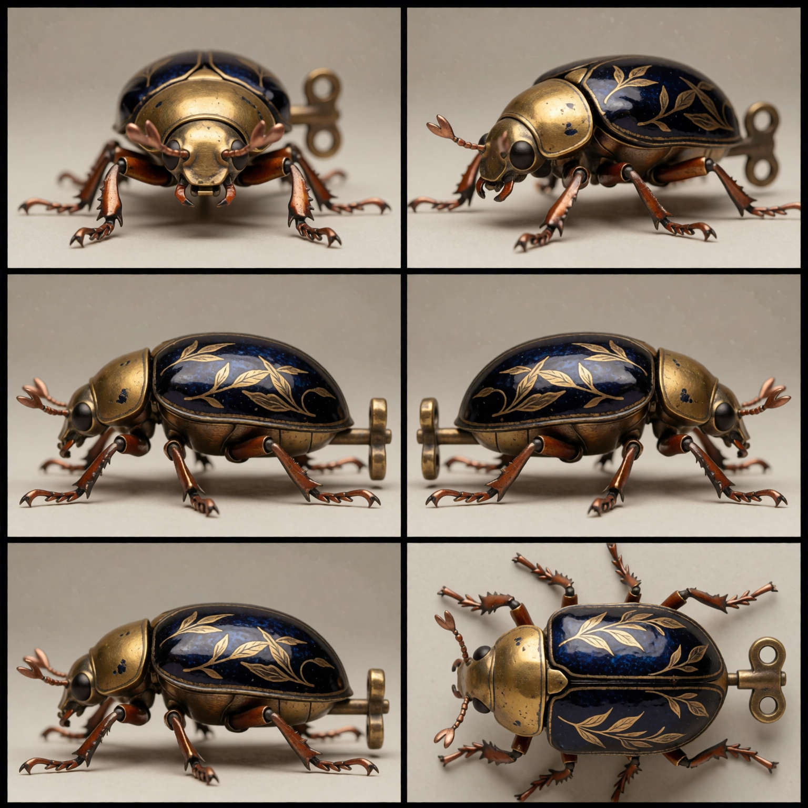
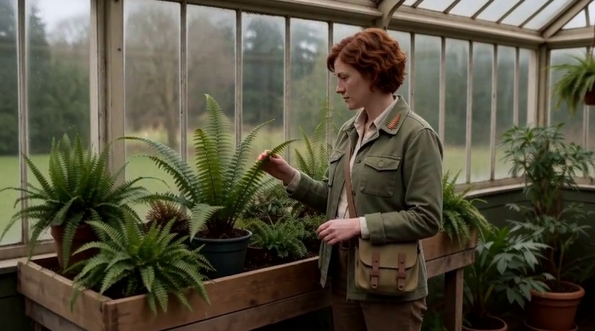

# SleepyOldOrbs · ComfyUI Workflows

A visual collection of my ComfyUI workflows, experiments and generated examples. **49 workflows · 34 example images · 2 video clips · Pixaroma prompt-tag libraries.**

This is also the home of the [Codex workflow development collection](development/README.md): 64 historical development/recovery workflows, the H3 custom nodes, builders, tests and development notes. The published workflows below remain the starting point for everyday use.

[Browse all workflows](CATALOG.md) · [Full image gallery](GALLERY.md) · [Getting started](docs/SETUP.md) · [Models and custom nodes](docs/DEPENDENCIES.md)

## Gold Standard: from stills to moving shots

New examples from workflows 07–10: finished photographs, entity reference sheets, a reference-driven H3 clip and a continuation from its final frame.

| 07 · Finished still | 08 · Reference sheet | 09 · Ref2VA clip | 10 · Continuation |
|---|---|---|---|
|  |  |  |  |

[Browse the examples, videos, captured workflows and instructions →](examples/GOLD-STANDARD.md)

## William Morris pattern gallery

Botanical ornament, wildlife and coordinated seasonal palettes, generated with Krea 2 and a William Morris style LoRA. Click a picture for its captured workflow.

| Christmas | Halloween | Easter |
|---|---|---|
|  |  |  |

| Summer | Winter | Autumn |
|---|---|---|
|  |  |  |

| Wildlife | Botanical | Mixed themes |
|---|---|---|
|  |  |  |

[See all 27 Morris images, captured workflows and generation data →](GALLERY.md)

## Explore the collection

The main catalogue contains **Codex MCP Demos** and **Gold-Standard**. Default template folders are excluded. Historical development and recovery files are listed separately in the [development collection](development/README.md).

| Collection | Workflows |
|---|---:|
| [Codex MCP Demos](workflows/Codex%20MCP%20Demos) | 27 |
| [Gold-Standard](workflows/Gold-Standard) | 22 |

## Start creating

1. Choose a workflow in the [catalogue](CATALOG.md) and read its model/node notes.
2. Download its JSON and open it in ComfyUI. Install its dependencies and select your model and input files.
3. For random prompts, [import the Pixaroma tags](docs/PIXAROMA-TAGS.md), then run a single image before increasing the batch count.

The Morris gallery requires a custom-trained LoRA whose weights are not distributed here. See [setup and availability](docs/SETUP.md). Other workflows include video, editing, upscaling and experimental pipelines; some require local custom nodes.

## Latest saved-workflow sync

On 24 September 2026, 3 existing Gold Standard workflows were refreshed from the local library and a separate MiniMax H3 development variant was added. This includes newer Krea2 face detailing, H3 settings and reference-sheet settings. See the [sync notes](docs/SYNC-2026-09-24.md) for scope and validation limits.

## About this release

This collection preserves my saved workflow variants from the two selected folders and their original notes. All exports have been structurally checked; the entire collection has not been rerun on a clean installation. The gallery covers the Morris family and six successful local runs of Gold Standard workflows 07–10. Each example includes the graph captured at generation time, which can differ from a subsequently edited library workflow.

Third-party authors and models retain their credits and terms. See [credits and provenance](CREDITS.md).
