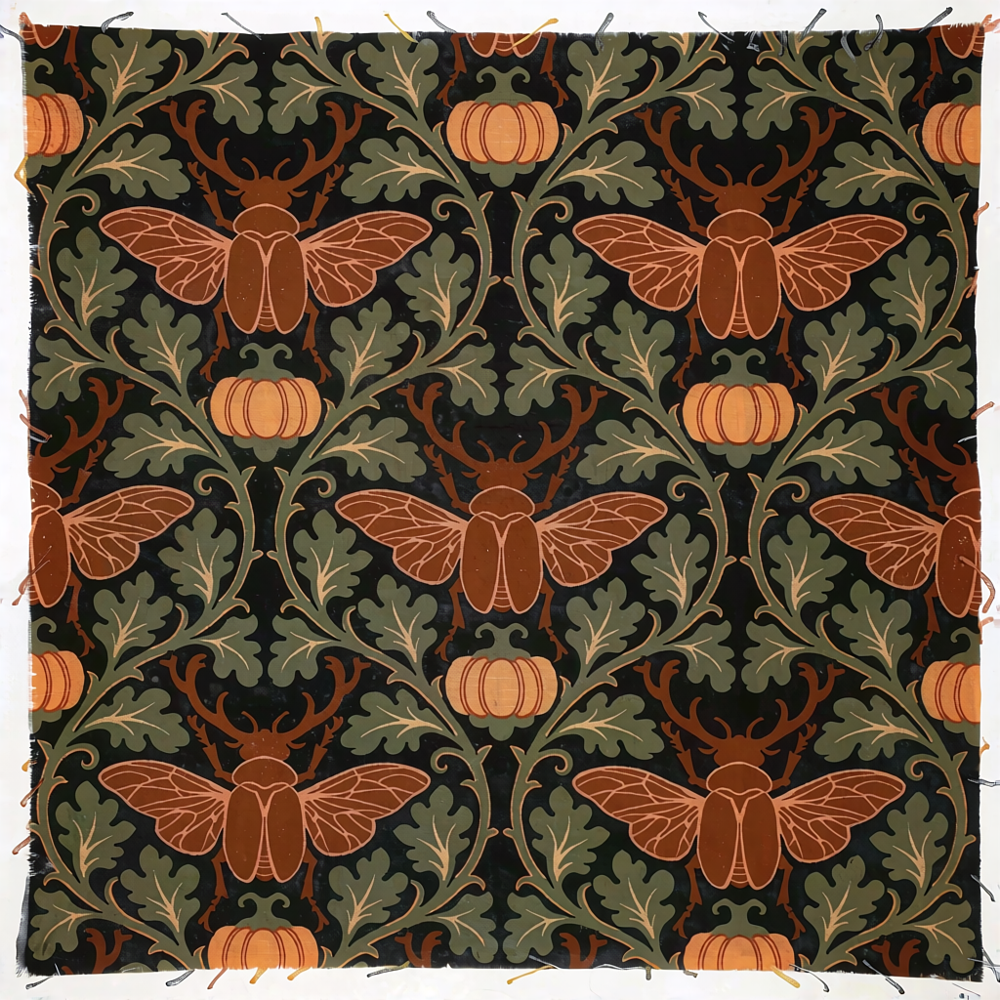
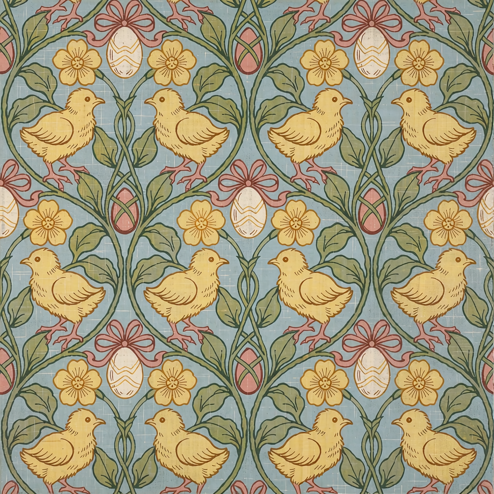
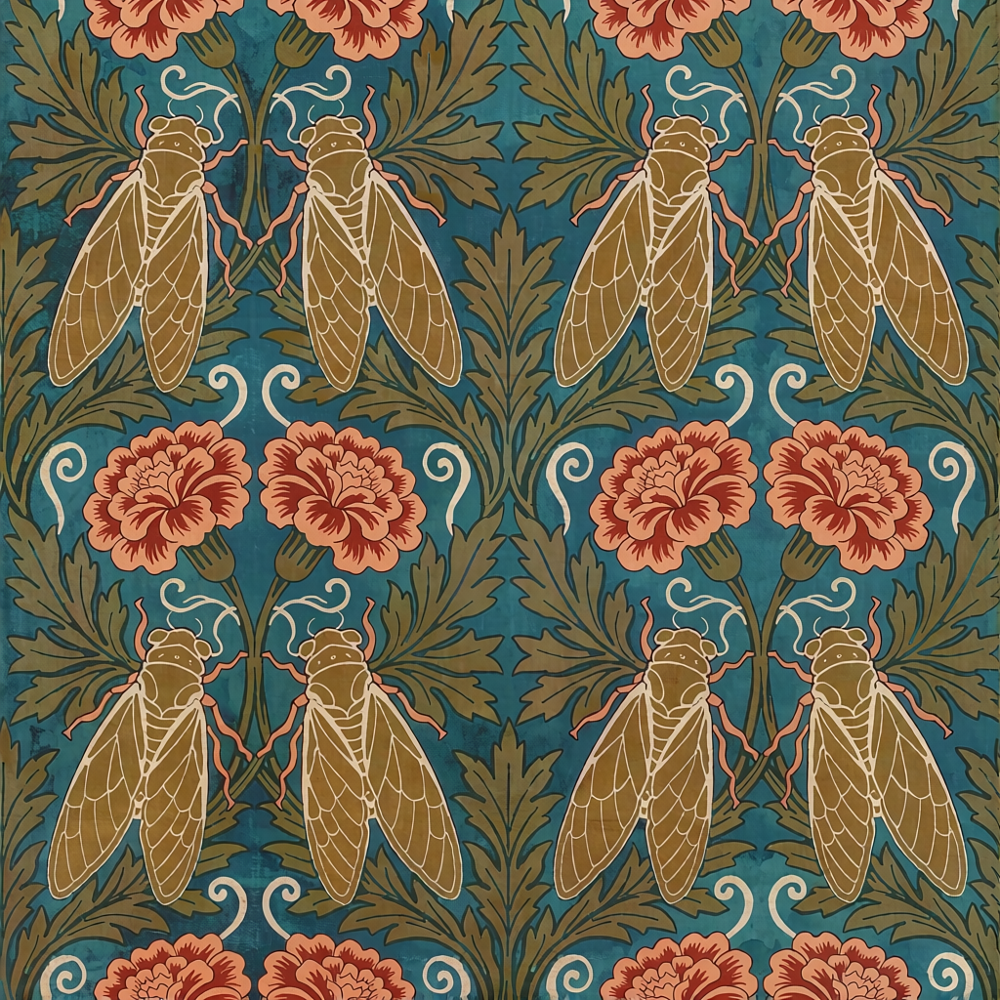
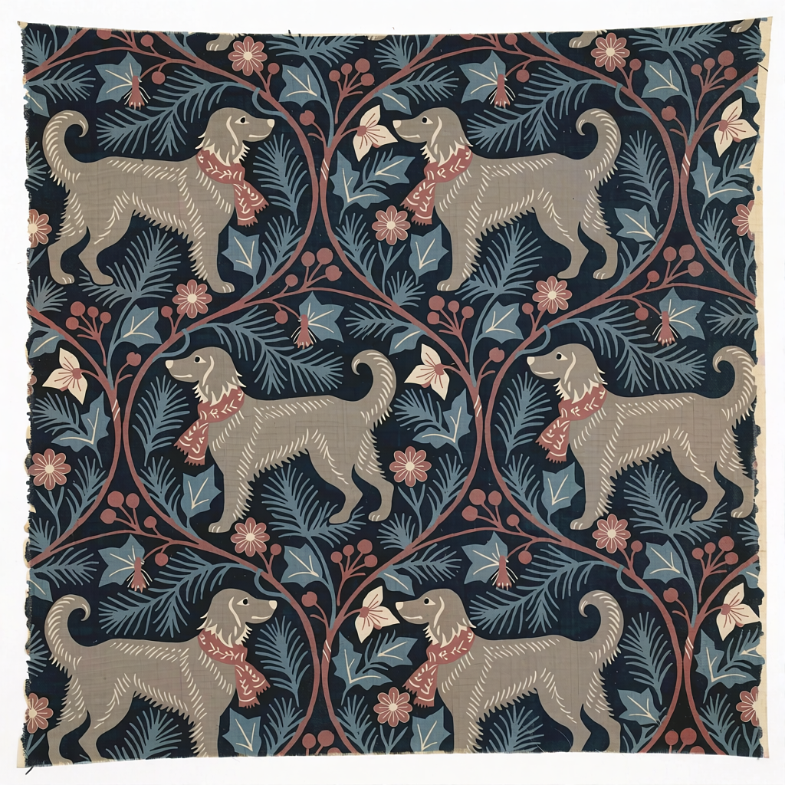
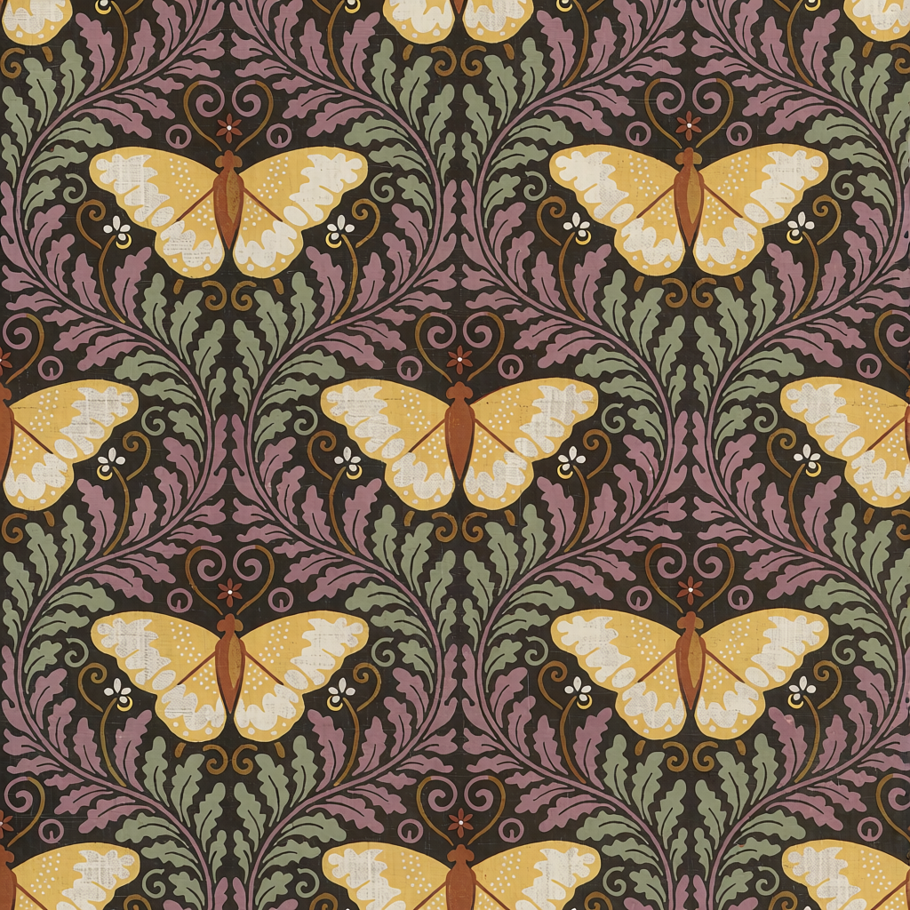
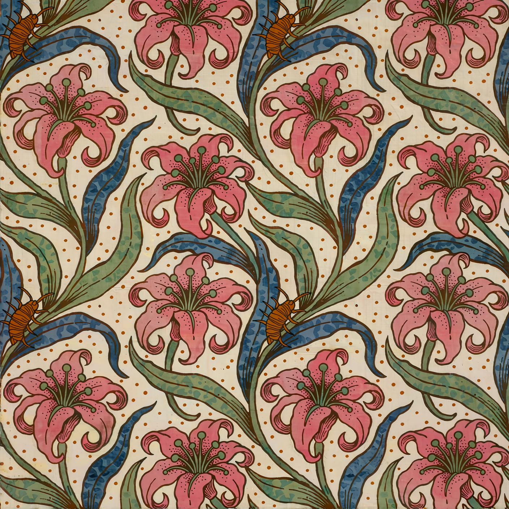

# SleepyOldOrbs · ComfyUI Workflows

A visual collection of my ComfyUI workflows, experiments and generated examples. **48 workflows · 27 example images · Pixaroma prompt-tag libraries.**

[Browse all workflows](CATALOG.md) · [Full image gallery](GALLERY.md) · [Getting started](docs/SETUP.md) · [Models and custom nodes](docs/DEPENDENCIES.md)

## William Morris pattern gallery

Botanical ornament, wildlife and coordinated seasonal palettes, generated with Krea 2 and a William Morris style LoRA. Click a picture for its captured workflow.

| Christmas | Halloween | Easter |
|---|---|---|
|  |  |  |

| Summer | Winter | Autumn |
|---|---|---|
|  |  |  |

| Wildlife | Botanical | Mixed themes |
|---|---|---|
|  |  |  |

[See all 27 images, captured workflows and generation data →](GALLERY.md)

## Explore the collection

Only **Codex MCP Demos** and **Gold-Standard** are published here. Default template folders are excluded.

| Collection | Workflows |
|---|---:|
| [Codex MCP Demos](workflows/Codex%20MCP%20Demos) | 27 |
| [Gold-Standard](workflows/Gold-Standard) | 21 |

## Start creating

1. Choose a workflow in the [catalogue](CATALOG.md) and read its model/node notes.
2. Download its JSON and open it in ComfyUI. Install its dependencies and select your model and input files.
3. For random prompts, [import the Pixaroma tags](docs/PIXAROMA-TAGS.md), then run a single image before increasing the batch count.

The Morris gallery requires a custom-trained LoRA whose weights are not distributed here. See [setup and availability](docs/SETUP.md). Other workflows include video, editing, upscaling and experimental pipelines; some require local custom nodes.

## About this release

This collection preserves my saved workflow variants from the two selected folders and their original notes. All exports have been structurally checked; the entire collection has not been rerun on a clean installation. The gallery currently covers the Morris family. Each example includes the graph captured at generation time, which can differ from a subsequently edited library workflow.

Third-party authors and models retain their credits and terms. See [credits and provenance](CREDITS.md).
