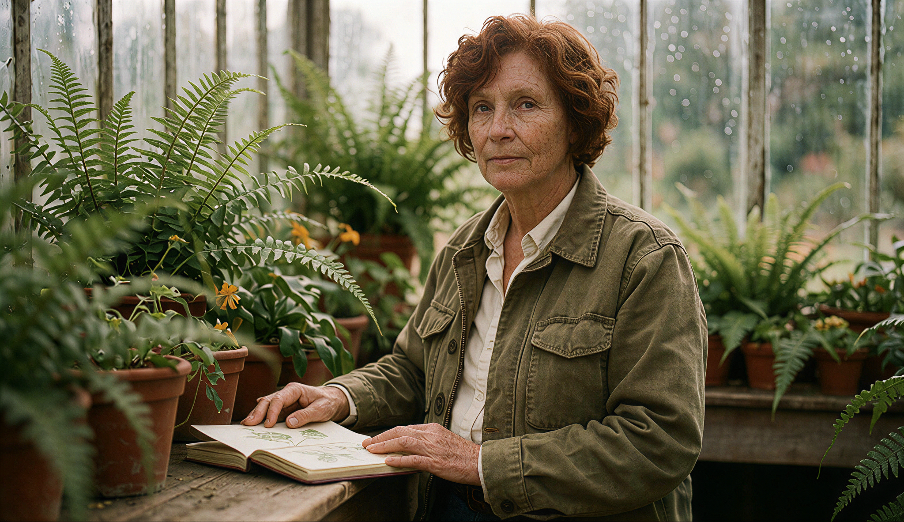
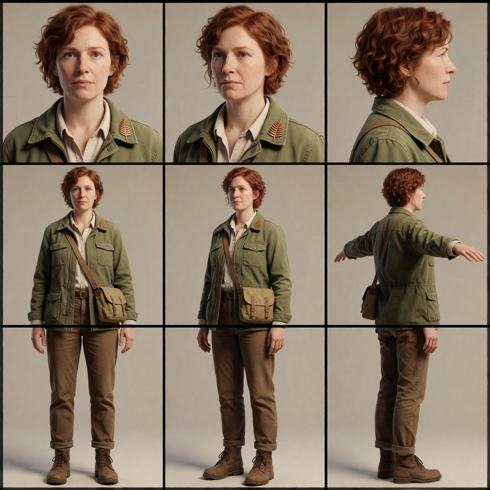

# Gold Standard examples: stills, reference sheets and video

Six successful local runs of workflows 07–10 on 4 September 2026: two finished stills, two reference sheets and two connected short video clips. The seven PNGs include the video posters and the handoff frame. All examples are AI-generated.

[Full collection](../CATALOG.md) · [Main gallery](../GALLERY.md) · [Setup](../docs/SETUP.md)

Use each example's **captured workflow** to load its actual run settings. The library workflows retain their saved defaults. Prompts, seeds, selected inputs and output folders were set in execution copies; the local library originals were left intact. Model weights and custom nodes are still required.

## 07 — Finished stills

Krea 2 generated the glasshouse portrait and Highland lake scene at 832 × 480. Both used the Quick Prompt route, AI prompt enhancement off, style LoRAs off, 30-step first pass and an enabled 10-step refinement pass at 0.30 denoise. The runs also executed the RTX comparison branch and the SeedVR2 2048-pixel finishing branch. The images below are the SeedVR2 finals with RCAS sharpening.

| Glasshouse portrait | Highland dawn |
|---|---|
|  |  |

## 08 — Entity reference sheets

Two 1536 × 1536 Krea 2 sheets, using the workflow's 8-step sampler and separate humanoid/turnaround routes. These examples use fixed subject descriptions in the Pixaroma prompt nodes so the published runs are self-contained; they do not depend on a particular tag shuffle position.

| Botanical explorer | Clockwork beetle |
|---|---|
|  |  |

The explorer sheet supplies the identity reference for workflow 09. Treat both sheets as generated design references: the explorer's lower views span panel boundaries, some requested poses are missing, and the beetle repeats a side view instead of supplying every requested angle. Check anatomy and view coverage before using a sheet for production modelling.

## 09 — Ref2VA Director

One five-second setting with a single enabled image reference: the explorer sheet above. A manually written six-section H3 prompt brings that subject into a glasshouse. The manual prompt route is selected; the optional AI rewrite is off. Generation uses 864 × 480, 124 frames at 24 fps and 20 sampling steps. The MP4 includes generated audio.

[Watch/download the video](gold-standard/09-ref2va-director/explorer.mp4) · [Resolved prompt](gold-standard/09-ref2va-director/explorer.prompt.txt)

To run the captured graph, download the [explorer sheet](gold-standard/08-reference-sheets/explorer.png) and place it at `ComfyUI/input/GoldGallery/explorer-sheet.png`. All six image loaders point to that file, but only reference 1 is enabled. Keep references 2–6 off. If you upload it under another name instead, select that uploaded filename in all six loaders, including the disabled reference branches.

## 10 — Long Form Shot Builder

This example demonstrates one continuation shot. Its opening image is the last decoded frame of workflow 09's MP4. Pixaroma Video Prompt uses the saved local 8B Qwen model to inspect that frame and write the motion prompt; H3 uses its separate conditioning encoder. The run retains the five-second tier, 20-step sampler and Balanced RTX 1.5× output finish. Automatic chaining is off and the optional M7 motion-context group remains bypassed. A separate continuation slot prevents this example from replacing the normal workflow's saved handoff state.

[Watch/download the continuation](gold-standard/10-long-form/continuation.mp4) · [Resolved generated prompt](gold-standard/10-long-form/continuation.prompt.txt) · [Opening/handoff frame](gold-standard/09-ref2va-director/handoff.png)

Place that handoff PNG at `ComfyUI/input/GoldGallery/09-last-frame.png` before running the captured workflow. Both image loaders point to that file; only the opening image is enabled. If you upload it under another name instead, select the uploaded filename in both loaders and keep the optional ending image off. This is a short continuation demonstration, not a completed long-form film or a test of automatic multi-shot chaining. Audio is generated separately for each clip.

## Downloads and recorded settings

PNG metadata and MP4 metadata contain sanitised workflow and API-prompt captures. Separate JSON files are provided below. PNG pixels and the encoded MP4 video/audio streams were preserved during publication. Video posters are decoded frames at about two seconds; the handoff is the last decoded frame of clip 09.

| Example | Captured workflow | API prompt | Output |
|---|---|---|---|
| 07-glasshouse-portrait | [Workflow](gold-standard/07-stills/glasshouse-portrait.workflow.json) | [API](gold-standard/07-stills/glasshouse-portrait.api.json) | [PNG](gold-standard/07-stills/glasshouse-portrait.png) |
| 07-highland-dawn | [Workflow](gold-standard/07-stills/highland-dawn.workflow.json) | [API](gold-standard/07-stills/highland-dawn.api.json) | [PNG](gold-standard/07-stills/highland-dawn.png) |
| 08-explorer-sheet | [Workflow](gold-standard/08-reference-sheets/explorer.workflow.json) | [API](gold-standard/08-reference-sheets/explorer.api.json) | [PNG](gold-standard/08-reference-sheets/explorer.png) |
| 08-beetle-sheet | [Workflow](gold-standard/08-reference-sheets/clockwork-beetle.workflow.json) | [API](gold-standard/08-reference-sheets/clockwork-beetle.api.json) | [PNG](gold-standard/08-reference-sheets/clockwork-beetle.png) |
| 09-ref2va-director | [Workflow](gold-standard/09-ref2va-director/explorer.workflow.json) | [API](gold-standard/09-ref2va-director/explorer.api.json) | [PNG](gold-standard/09-ref2va-director/explorer.png) · [MP4](gold-standard/09-ref2va-director/explorer.mp4) |
| 10-long-form | [Workflow](gold-standard/10-long-form/continuation.workflow.json) | [API](gold-standard/10-long-form/continuation.api.json) | [PNG](gold-standard/10-long-form/continuation.png) · [MP4](gold-standard/10-long-form/continuation.mp4) |

| Video | Delivered size | Frames | Duration | Audio |
|---|---|---:|---:|---|
| 09-ref2va-director | 864 × 480 | 124 | 5.175 s | Yes |
| 10-long-form | 1296 × 720 | 124 | 5.175 s | Yes |

[Machine-readable run records and seeds](../catalog/gold-standard-runs.json) · [Recorded runtime and GPU](../catalog/gold-standard-environment.json). Exact reproduction can vary with model versions, GPU arithmetic, custom nodes and the generated video prompt. Runs were checked on the existing local installation; this does not establish that every dependency works on a fresh installation.
